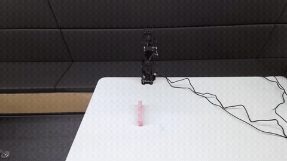
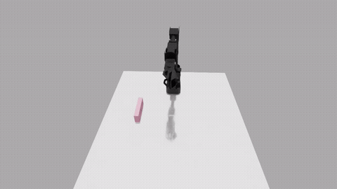
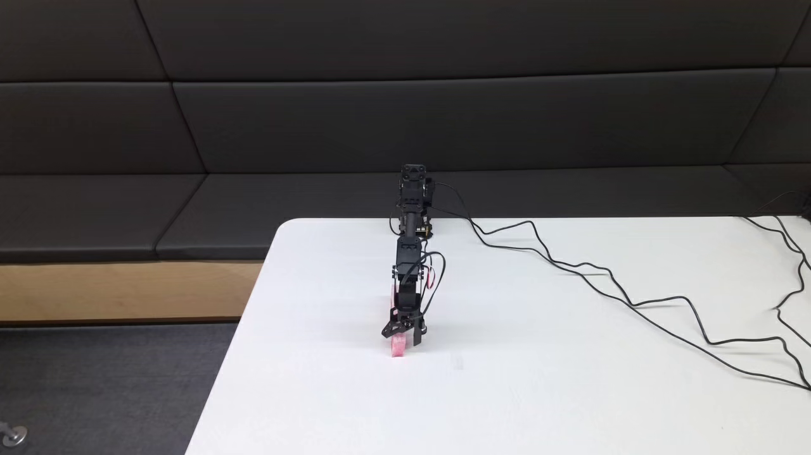
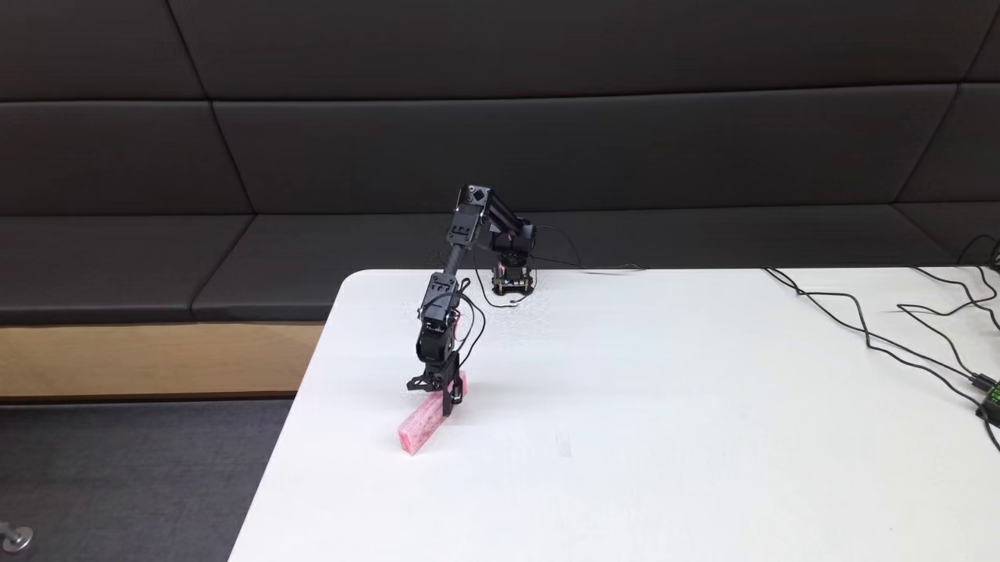
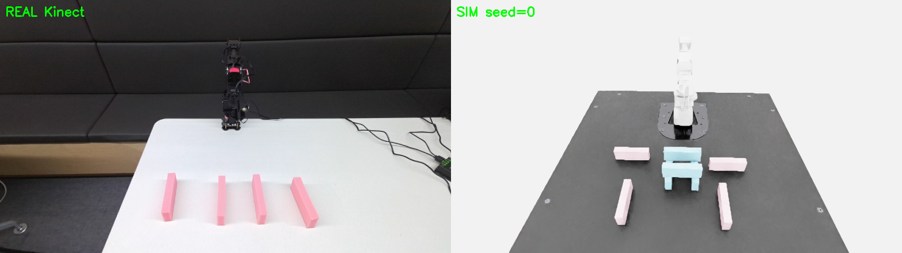
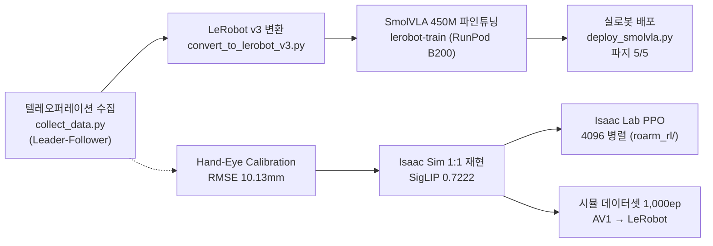
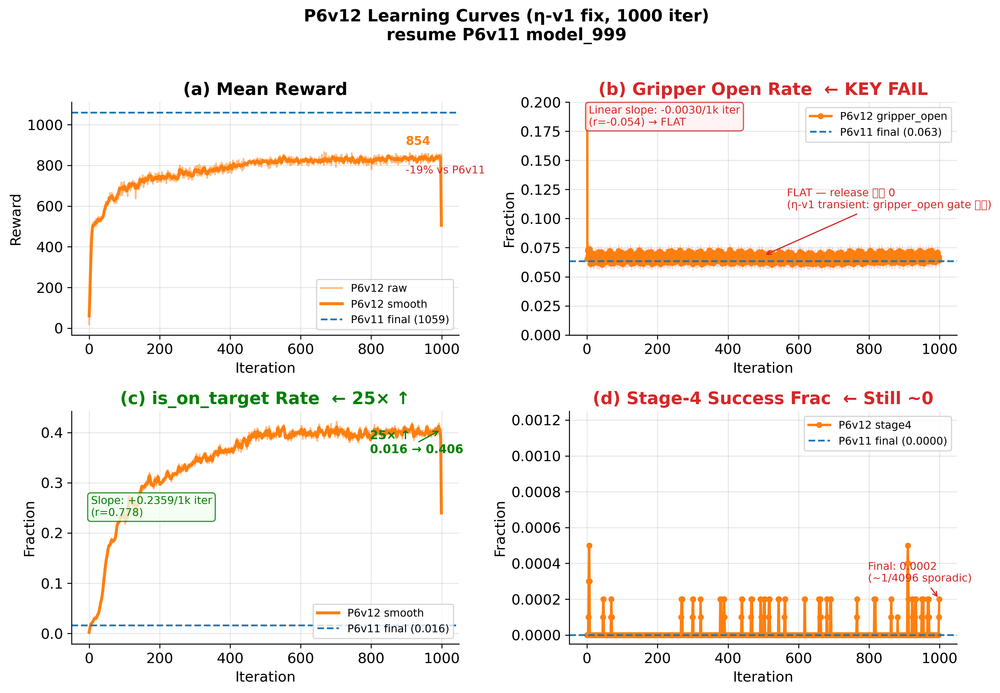

# RoArm-M3 Pro × VLA — 실로봇 매니퓰레이션 학습 파이프라인

약 $200 급 6-DOF 로봇팔(Waveshare RoArm-M3 Pro)과 Azure Kinect DK 로
**데이터 수집 → VLA 파인튜닝 → 실로봇 배포 → sim2real 정렬 → 대규모 RL** 전 구간을
단독 구축하고, 구간마다 정량 지표를 남긴 연구 저장소입니다.

<p align="center">
  
  
</p>
<p align="center"><sub>좌: Leader-Follower 텔레오퍼레이션 데이터 수집 (v6, 50 에피소드 top-view) · 우: Isaac Lab PPO 정책 롤아웃 (시뮬레이션)</sub></p>

## 핵심 결과

| 구간 | 결과 | 근거 |
|---|---|---|
| VLA 실로봇 배포 | SmolVLA 450M, 텔레옵 74 에피소드 파인튜닝 → 스펀지 파지 **5/5 성공** (open-loop 4-chunk) | `claudedocs/BASELINE.md`, `lab_meeting_presentation.md` |
| 학습 디버깅 | 커스텀 학습 3회 실패 원인 3가지 규명 → L2 오차 **43-84 → 4.39** | `SMOLVLA_TRAINING_RESULTS.md` §11-13 |
| Hand-Eye Calibration | 1차 SVD 평균 2.00cm → 2차 마커 방식 **RMSE 10.13mm**, 테이블 평면 RMSE 1.24mm | `CALIBRATION_LOG.md` |
| Sim2Real 정렬 | 실제 Kinect 시점을 Isaac Sim 에 1:1 재현 — joint replay **RMSE 0.43°**, SigLIP 유사도 **0.7222** (48/50 GO) | `claudedocs/stepDE_siglip50_sim_v1_20260424.md` |
| Isaac Lab RL | DirectRLEnv + rsl_rl PPO, B200 **4096 병렬** 환경, 240~258K steps/s, reach/lift/grasp ~96% 수렴 | `roarm_rl/`, `claudedocs/labmeeting_5slides_20260512.md` |
| 시뮬 데이터셋 | Isaac Sim 렌더 **1,000 에피소드 / 195,000 프레임** → AV1 코덱 LeRobot 포맷 변환 | `claudedocs/dataset_archives/` |
| 재현성 | B200 ↔ RTX4090 학습 loss bit-exact 검증, 속도 3.7배 (1.4h vs 5.2h) | `AGENTS.md` |
| 스케일 확장 | OpenVLA-OFT 7B LoRA 파인튜닝 + RLDS 변환 + 오프라인 체크포인트 랭킹 | `openvla_oft_roarm/` |

<p align="center">
  
  
  
</p>
<p align="center"><sub>좌·중: 실로봇 배포 파지 성공 장면 (SmolVLA, 서로 다른 위치) · 우: 실제 ↔ Isaac Sim 렌더 정렬 비교</sub></p>

## 파이프라인



## 정직한 실패 기록

이 저장소는 성공만 기록하지 않습니다. 실패의 원인 규명이 연구의 절반입니다.

- **RL place 태스크 실패 분석**: reward 는 수렴하지만 태스크가 실패하는 현상을 4단계 진단 체인으로 추적 —
  hold-path 보상이 전이 대비 **41배 우세**한 reward misspecification 을 정량화 (`claudedocs/labmeeting_5slides_20260512.md`)
- **배포 실패 FK 포렌식**: 그리퍼 개방 시점 엔드이펙터 z=347mm(공중)를 규명, 학습 데이터 분포 문제로 귀속 (`deploy_openloop_report.md`)
- **'proprioceptive echo' 진단**: v5 모델이 상태를 그대로 되돌려주는 붕괴 모드 발견 (`train_v5_eval_results.md`)

<p align="center">
  
</p>

## 저장소 지도

```
collect_data*.py            # 텔레오퍼레이션 데이터 수집 (hand-guide / keyboard / Leader-Follower)
convert_to_lerobot_v3.py    # LeRobot v3 데이터셋 변환
deploy_smolvla.py           # 실로봇 배포 (open-loop chunk 실행)
calibrate_azure_kinect.py   # Hand-Eye Calibration
roarm_rl/                   # Isaac Lab DirectRLEnv + rsl_rl PPO (4096 병렬)
openvla_oft_roarm/          # OpenVLA-OFT 7B LoRA 파인튜닝 + RLDS 변환
lerobot_dataset_v*/         # 수집 데이터셋 (v3: 74ep, v5: 136ep, v6: 50ep/6,942fr)
CALIBRATION_LOG.md          # 캘리브레이션 전 과정 기록
SMOLVLA_TRAINING_RESULTS.md # 학습 실패→성공 전체 과정
claudedocs/                 # 세션 단위 연구 로그 (실험·진단·랩미팅 자료)
```

## 하드웨어 / 환경

- Waveshare RoArm-M3 Pro (6-DOF, ESP32 + ST3215 버스 서보) · Azure Kinect DK
- 학습: RunPod 클라우드 GPU (B200 / H100 / RTX4090) — `requirements_core.txt`, `LINUX_SETUP_GUIDE.md`
- 스택: LeRobot 0.4.4 · SmolVLA 450M · OpenVLA-OFT 7B · Isaac Sim / Isaac Lab · rsl_rl · pyk4a · OpenCV

## 연구 방향

각 구간의 독립 검증을 마쳤고, 다음 단계는 (1) sim 학습 정책의 실기 전이 검증,
(2) sim 렌더 데이터 증강이 VLA 실로봇 성공률에 미치는 영향의 정량화,
(3) 표준화된 이식 절차의 다른 저가 매니퓰레이터로의 일반화입니다.
